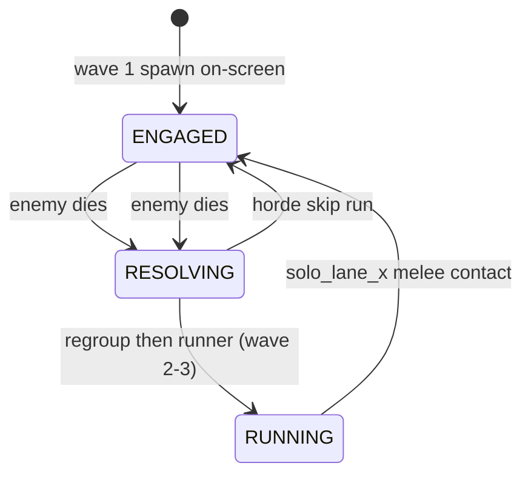

# Combat phase flow

## Sim phase (`CombatEncounter.Phase`)

## Party field state (`PartyService.PartyFieldState`, during RUNNING)

```mermaid
stateDiagram-v2
    [*] --> FORMATION_MARCH: PHASE_CHANGED RUNNING
    FORMATION_MARCH --> BATTLE_APPROACH: any_hero_in_engage_range
    BATTLE_APPROACH --> ENGAGED: sim engage / melee contact
    ENGAGED --> FORMATION_MARCH: march from combat pose; regroup offsets while walking
```

- **FORMATION_MARCH** — `commit_march_from_combat()` then two-phase regroup: (1) **CONVERGE** — lead fixed, spreads close with per-slot catch-up speeds (<0.8s), normal BG scroll; (2) **RETREAT** — whole party slides left (`_march_lead_x → 0`, ~0.6s) with BG `regroup_scroll_speed`; then normal runner scroll until next enemy.
- **BATTLE_APPROACH** — scroll stops; `advance_battle_positions()`; `battle_approach_active` on encounter; per-slot `can_hero_attack_slot`.
- **ENGAGED** — scroll off; all slots attack.

## Events

| Event | Emitter | Bridge / controller action |
|-------|---------|----------------------------|
| `PHASE_CHANGED RUNNING` | `CombatSimulator.start_runner_phase` | `begin_formation_march`, scroll on |
| `PHASE_CHANGED ENGAGED` | `CombatSimulator.engage` | `set_field_state(ENGAGED)`, scroll off |
| `SWARM_ATTACK` | Sim tick (solo or horde) | `begin_attack` on visuals |
| `ENEMY_HIT_HERO` | Sim tick (solo) | `party.apply_damage_to_hero` |
| `HERO_HIT_ENEMY` | `apply_hero_hit` | HP bar + flash |

**Death → next wave:** `CombatController._resolve_death` → loot → `regroup_to_formation` → `start_runner` → spawn off-screen (not horde).

Horde damage still uses `attack_impact` → `CombatController._apply_enemy_damage_to_hero` until fully migrated.
