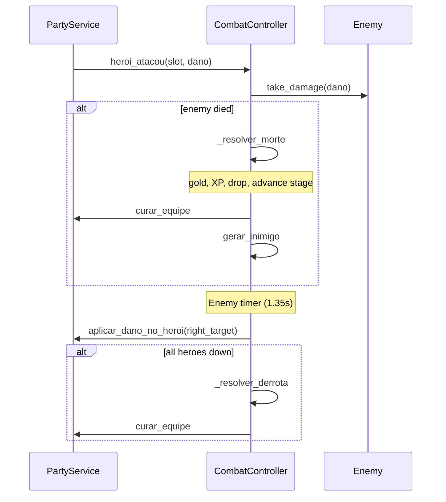

# Idle Combat

Combat is **fully automatic**: three hero slots attack on independent timers; the enemy counter-attacks the rightmost living hero. There is no attack input — the player influences outcomes via party composition, equipment, skill tree, and selected stage.

**Code:** rules in `domains/combat/`; visuals in `presentation/combat/`.

## Core components

| Class / file | Role |
|--------------|------|
| `PartyService` | Party of up to 3 heroes, timers, DPS, HP, serialization |
| `CombatController` | Combat loop, enemy death, defeat, stage advance |
| `DropManager` | Gold variance and item drop chance |
| `Enemy` | HP, damage, rewards |
| `HeroProgress` | XP/level per class (used after death) |

## PartyService

`PartyService` is the party service. Responsibilities:

- **3 slots** (`SLOTS = 3`), each with `ClassData` or empty.
- **Per-hero timer** — interval `INTERVALO_BASE / attack_speed` (min. 0.25s).
- **Damage calculation** — class base + equipment + level + skill-tree bonuses (`ataque`, `ataque_pct`).
- **HP** — base HP + equipment + level + tree bonuses; rightmost hero is the enemy target.
- **Injected callables** (from `main`):
  - `obter_dano_equip(slot) -> int`
  - `obter_vida_equip(slot) -> int`
  - `obter_nivel(slot) -> int`
  - `obter_bonus_arvore(slot) -> Dictionary`

Default party uses English class IDs: `warrior`, `mage`, `archer`.

### Signals

| Signal | When |
|--------|------|
| `equipe_alterada` | Class swapped or removed |
| `heroi_atacou(slot, dano)` | Slot timer fired |
| `dps_alterado(dps, dano_grupo)` | Total DPS recalculated |

### Relevant API

```gdscript
func escalar_personagem(slot_index: int, nova_classe: ClassData = null) -> void
func incluir_classe(classe: ClassData) -> int
func remover_do_slot(slot_index: int) -> bool
func dano_do_heroi(slot_index: int) -> int
func aplicar_dano_no_heroi(slot_index: int, quantidade: int) -> bool
func curar_equipe() -> void
func recalcular_status() -> void
func serializar() -> Dictionary  # {"classes": [...], "desbloqueadas": [...]}
```

`combate_pausado` blocks timers during death/defeat resolution.

## Combat loop (`CombatController`)



### Resolution states

- `_resolvendo_morte` — pauses combat, death animation, rewards, new enemy.
- `_resolvendo_derrota` — shows "Party defeated!" toast, full heal, same enemy recreated.

### Enemy generation

`WorldProgress.stats_inimigo(world, stage, difficulty)` returns HP, damage, gold, XP, and `nivel` (global stage index). Boss = stage 9 of each world (`CHEFE_VIDA`, `CHEFE_DANO` multipliers).

### Stage advance

After a kill, `_avancar_fase()`:

1. Updates `fases_liberadas[difficulty]` via `WorldProgress.aplicar_conclusao`.
2. If `repetir_fase == false`, advances with `WorldProgress.proximo`.
3. Emits world/difficulty unlock toasts.

## Drops (`DropManager`)

| Constant | Value | Effect |
|----------|-------|--------|
| `DROP_CHANCE` | 0.30 | 30% item after kill |
| `GOLD_VARIANCE` | 0.15 | ±15% on gold |

- **Gold** — `gold_with_variance(base)`; then skill-tree `bonus_ouro` in `CombatController`.
- **Item** — `ItemDatabase.gerar_item_aleatorio(enemy_level)`; ~22% gem chance.
- **XP** — applied to all active party classes; `bonus_xp` from skill tree.

Signal `item_dropado(item: ItemData)` → `main` adds to inventory.

## Skills in combat

`HeroEquipment` (autoload in `domains/combat/hero_equipment.gd`) stores up to 2 active + 2 passive skills per class. Cooldown runtime lives in `domains/combat/` (e.g. `archer_skills.gd`, `skill_runtime.gd`). **Equipped skills persist in save v4** — see [`save-format.md`](save-format.md).

## UI integration

`CombatController` does **not** reference HUD nodes directly; it receives injected references:

- `inimigo_visual`, `barra_vida` — visual feedback
- `obter_destino_ouro` — coin effect origin
- Signals `hud_atualizar`, `efeito_moedas_pedido`, `aviso`

## Checklist when changing combat

1. Do DPS and HP recalculate with equipment + skill tree?
2. Do death/defeat leave no orphaned timers?
3. Is `precisa_salvar` emitted after relevant progress?
4. Playtest: idle attacks, enemy dies, defeat heals party.
