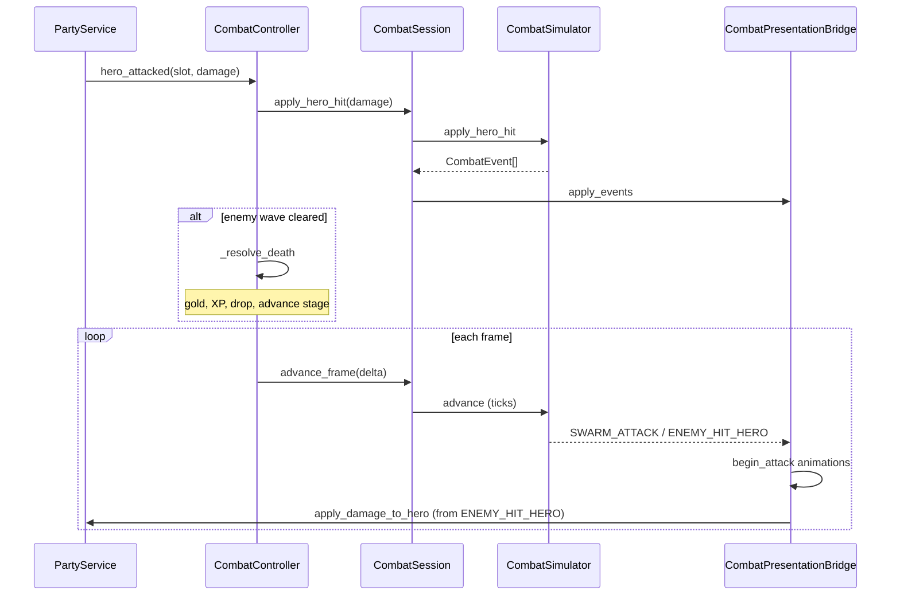

# Idle Combat

Combat is **fully automatic**: three hero slots attack on independent timers; the enemy counter-attacks the rightmost living hero. There is no attack input — the player influences outcomes via party composition, equipment, skill tree, and selected stage.

**Code:** rules in `domains/combat/` (simulation + orchestration); visuals in `presentation/combat/`.

## Tick-based simulation (`domains/combat/sim/`)

Combat rules run in a **discrete tick loop** (0.25s, aligned with `PartyService` minimum attack interval). Presentation mirrors simulation state; it never applies damage.

| Class / file | Role |
|--------------|------|
| `CombatEncounter` | Serializable encounter state (party targets, horde squad, runner phase) |
| `CombatSimulator` | Tick advance, horde lane movement, swarm cadence, hero-hit resolution |
| `CombatEvent` | Domain events (`HERO_HIT_ENEMY`, `SWARM_ATTACK`, `ENEMY_WAVE_CLEARED`, …) |
| `CombatActorGroup` | Horde / queue squad with abstract lane positions |
| `DamagePipeline` | Single-pass hero/enemy damage (uses `CombatMath`) |
| `CombatActionQueue` | Per-tick action drain (enemy attacks; skills queued incrementally) |
| `CombatSession` | Wires encounter + simulator + `CombatPresentationBridge` |
| `CombatPresentationBridge` | Maps `CombatEvent` → sprites, VFX, audio (no combat rules) |
| `CombatTuning` | Shared scroll/spawn/runner constants for sim + presentation |

`CombatController` keeps **meta-combat** only: stage advance, gold/XP signals, save hooks. It delegates spawn, hero hits, and enemy cadence to `CombatSession`.

### Runner phase (between waves 1–3)

After killing a wave, the party **regroups** into formation, then enters `CombatEncounter.Phase.RUNNING`:

1. `CombatController` calls `PartyService.regroup_to_formation()` — `commit_march_from_combat()` preserves each hero's screen X, then a **two-phase regroup** runs while the runner starts:
   - **Converge** (`FORMATION_REGROUP_SPREAD_SEC`, 0.8s max): `_march_lead_x` stays fixed; each `_formation_spread_x[slot]` closes to 0 with per-slot catch-up speed (archer fast, front tank slow `FORMATION_REGROUP_FRONT_RUN_SCALE`); BG scrolls at normal `SCROLL_SPEED_PX`.
   - **Retreat** (`FORMATION_REGROUP_RETREAT_SEC`, 0.6s): spreads are 0; `_march_lead_x` returns to 0 so the whole party slides left to `hero_slot_x` while the BG scrolls at matched `regroup_scroll_speed`.
2. Callback starts `CombatSimulator.start_runner_phase()` → `PHASE_CHANGED: RUNNING`.
3. `CombatPresentationBridge` calls `begin_formation_march()` (idempotent) — run animation + background scroll (`CombatTuning.SCROLL_SPEED_PX`).
4. Next enemy spawns off-screen; `solo_lane_x` advances in the sim until `solo_contact_x`.

### Party field states (presentation)

`PartyService.PartyFieldState` mirrors formation/combat visuals while the sim may still be `RUNNING`:

| State | When | Visual |
|-------|------|--------|
| `FORMATION_MARCH` | RUNNING, no enemy in any hero engage range | Heroes in slot offsets + road extras; BG scrolls |
| `BATTLE_APPROACH` | RUNNING, enemy within range of at least one hero | Auto BG scroll stops; edge-scroll kicks in when `engage_lane_slot()` X exceeds `STAGE_WIDTH_HALF - COMBAT_EDGE_MARGIN` (BG UV advances, frame fixed); melee advance on X; ranged slots attack; enemy stops at `frontline_slot()` (highest X alive), attacks that hero, then advances to the next after a kill |
| `ENGAGED` | Sim `engage()` / wave 1 on-screen spawn | Auto scroll stops; edge-scroll holds heroes inside the road BG; full combat |

**Per-slot attack gate:** `CombatController.can_hero_attack_slot(slot)` — during `BATTLE_APPROACH`, only heroes whose `hero_combat_x` is within `HeroSpritesheet.engage_range(class)` may fire timers/skills. Sim sets `CombatEncounter.battle_approach_active` so `apply_hero_hit` accepts damage before melee contact.

On sim engage → `PHASE_CHANGED: ENGAGED` → scroll stops, solo minion cadence via sim ticks (`SWARM_ATTACK` + `ENEMY_HIT_HERO`).

**Lane targets:** `PartyService.engage_lane_slot()` (rightmost living hero X) drives spawn, stop line, and `hero_front_lane_x`. `right_target_index()` remains the damage target for enemy hits.

Wave 1 solo uses the same opening runner as later waves (off-screen spawn + formation march). Horde waves still spawn already engaged.

### Horde spawn (unified catalog)

`EnemyData.horde_count` + `horde_attack_mode` (`SWARM` | `QUEUE`) replace the legacy horde wave catalog. `EnemyCatalog.resolve_horde()` is the single spawn entry for multi-enemy waves.

### Observable events (assisted logging)

Structured logging still listens to **controller/party signals** (`hero_attacked`, `enemy_hit`, `enemy_died`, …). The simulator emits `CombatEvent` internally; the controller translates them into the existing signal contract for `EventLogBridge`.

## Core components

| Class / file | Role |
|--------------|------|
| `PartyService` | Party of up to 3 heroes, timers, DPS, HP, serialization |
| `CombatController` | Meta-combat: death/defeat, stage advance, economy signals |
| `CombatSession` | Simulation orchestration for the active encounter |
| `DropManager` | Gold variance and item drop chance |
| `Enemy` | HP, damage, rewards |
| `HeroProgress` | XP/level per class (used after death) |

## PartyService

`PartyService` is the party service. Responsibilities:

- **3 slots** (`SLOTS = 3`), each with `ClassData` or empty.
- **Per-hero timer** — interval `INTERVALO_BASE / attack_speed` (min. 0.25s).
- **Damage calculation** — class base + equipment + level + skill-tree bonuses (`ataque`, `ataque_pct`).
- **HP** — base HP + equipment + level + tree bonuses; rightmost hero is the enemy target.
- **Injected callables** (from `main`):
  - `obter_dano_equip(slot) -> int`
  - `obter_vida_equip(slot) -> int`
  - `obter_nivel(slot) -> int`
  - `obter_bonus_arvore(slot) -> Dictionary`

Default party uses English class IDs: `warrior`, `mage`, `archer`.

### Signals

| Signal | When |
|--------|------|
| `equipe_alterada` | Class swapped or removed |
| `heroi_atacou(slot, dano)` | Slot timer fired |
| `dps_alterado(dps, dano_grupo)` | Total DPS recalculated |

### Relevant API

```gdscript
func escalar_personagem(slot_index: int, nova_classe: ClassData = null) -> void
func incluir_classe(classe: ClassData) -> int
func remover_do_slot(slot_index: int) -> bool
func dano_do_heroi(slot_index: int) -> int
func aplicar_dano_no_heroi(slot_index: int, quantidade: int) -> bool
func curar_equipe() -> void
func recalcular_status() -> void
func serializar() -> Dictionary  # {"classes": [...], "desbloqueadas": [...]}
```

`combate_pausado` blocks timers during death/defeat resolution.

## Combat loop (`CombatController` + `CombatSession`)



### Resolution states

- `_resolvendo_morte` — pauses combat, death animation, rewards, new enemy.
- `_resolvendo_derrota` — shows "Party defeated!" toast, full heal, same enemy recreated.

### Enemy generation

Base stats from `WorldProgress.enemy_stats(world, stage, difficulty)` (HP, damage, gold, XP, global `level` index). Stage 9 applies boss multipliers (`BOSS_HP_MULT`, `BOSS_DAMAGE_MULT`).

**Enemy catalog** (`data/enemy_catalog.gd`):

1. Scans `data/enemies/*.tres` (`EnemyData` resources).
2. `resolve(world, stage, stage_wave, role)` picks archetype by spawn scope.
3. `build_runtime()` applies per-enemy multipliers (`hp_mult`, `damage_mult`, …).
4. Stage 9 main enemy uses `SpawnRole.BOSS` (demon king per dimension).

Visuals: `EnemyVisualProfile` → `EnemySpritesheetBuilder` → `EnemyVisual.configure()`.

Workflow: [`docs/workflows/add-enemy.md`](../workflows/add-enemy.md). Agent skill: `/add-enemy`.

### Stage advance

After a kill, `_advance_stage()`:

1. Updates `unlocked_stages[difficulty]` via `WorldProgress.apply_stage_completion`.
2. If `repeat_stage == false`, advances with `WorldProgress.next_stage`.
3. Emits toasts: `COMBAT_REALM_SAVED` (boss), `COMBAT_PORTAL_UNLOCKED` (new dimension), `COMBAT_DIFFICULTY_UNLOCKED` (new trail). See [`portals-saga.md`](portals-saga.md).

## Drops (`DropManager`)

| Constant | Value | Effect |
|----------|-------|--------|
| `DROP_CHANCE` | 0.30 | 30% item after kill |
| `GOLD_VARIANCE` | 0.15 | ±15% on gold |

- **Gold** — `gold_with_variance(base)`; then skill-tree `bonus_ouro` in `CombatController`.
- **Item** — `ItemDatabase.gerar_item_aleatorio(enemy_level)`; ~22% gem chance.
- **XP** — applied to all active party classes; `bonus_xp` from skill tree.

Signal `item_dropado(item: ItemData)` → `main` adds to inventory.

## Skills in combat

`HeroEquipment` (autoload in `domains/combat/hero_equipment.gd`) stores up to 2 active + 2 passive skills per class.

| Component | Role |
|-----------|------|
| `skill_runtime.gd` | Passive stat bonuses from equipped passives |
| `active_skill_runtime.gd` | Active cooldowns and cast priority |
| `combat_resolver.gd` | Resolves `SkillResource.effects` into hits/buffs |
| `buff_container.gd` | Timed combat buffs per party slot |

On each hero timer tick, equipped actives (slot 0 → 1) are tried before a basic attack. See [`active-skills.md`](active-skills.md).

**Equipped skills persist in save v4** — cooldowns do not (MVP). See [`save-format.md`](save-format.md).

## UI integration

`CombatController` does **not** reference HUD nodes directly; it receives injected references:

- `inimigo_visual`, `barra_vida` — visual feedback
- `obter_destino_ouro` — coin effect origin
- Signals `hud_atualizar`, `efeito_moedas_pedido`, `aviso`

## Checklist when changing combat

1. Do DPS and HP recalculate with equipment + skill tree?
2. Do death/defeat leave no orphaned timers?
3. Is `precisa_salvar` emitted after relevant progress?
4. Playtest: idle attacks, enemy dies, defeat heals party.
