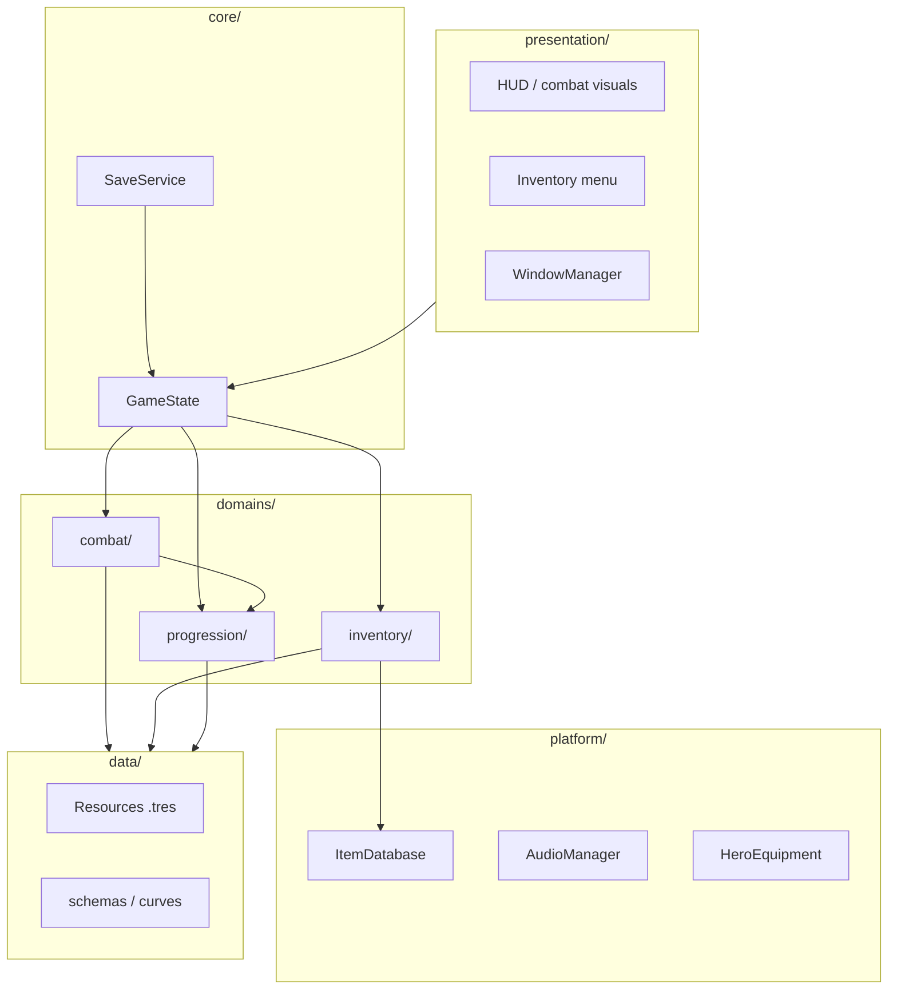

# Architecture Overview

Stickman Idle is a 2D idle RPG in Godot 4.7 with a transparent desktop overlay window. The game runs in an automatic loop: heroes attack, enemies die, gold and XP are earned, and the player manages inventory and progression in side panels.

## Canonical structure

| Module | Path |
|--------|------|
| Main scene | `scenes/main.gd` + `core/game_state.gd` |
| Combat (rules) | `domains/combat/` |
| Combat (visual) | `presentation/combat/` |
| Inventory (rules) | `domains/inventory/` |
| Inventory (UI) | `presentation/inventory/` |
| Portals (dimensions UI) | `presentation/worlds/` + [`portals-saga.md`](architecture/portals-saga.md) |
| Data | `data/` (`data/skills/` for skills) |
| Autoloads | `platform/` |
| Overlay window | `presentation/shared/window_manager.gd` |

## Module diagram



## Runtime data flow

1. **Boot** — `main` instantiates `WindowManager`, `CombatController`, `InventoryMenu`, registers with `SaveSystem`, and loads `user://save.cfg`.
2. **Idle combat** — `PartyService` fires `heroi_atacou` per timer; `CombatController` applies damage, resolves death/defeat, emits gold/XP/drops.
3. **Progression** — `HeroProgress` accumulates XP per class; `WorldProgress` defines enemy stats and stage unlocks.
4. **Meta** — `InventoryMenu` manages gold (via callbacks), equipment, skill tree (`SkillTreeProgress`), forge, and warehouse.
5. **Persistence** — `main.collect_save()` aggregates state; `SaveService` writes to `ConfigFile` with `SAVE_VERSION = 4`.

```text
PartyService.heroi_atacou
	→ CombatController.on_heroi_atacou
		→ Enemy.take_damage
		→ (death) DropManager + HeroProgress.apply_xp
		→ main (gold, HUD, inventory)
		→ SaveSystem.save (autosave / events)
```

## Module boundaries

| Module | Responsibility | Must not |
|--------|----------------|----------|
| `domains/combat/` | Party, combat loop, drops, skill runtime | Import UI nodes |
| `domains/progression/` | XP, worlds, skill tree, stat calculation | Mutate gold directly |
| `domains/inventory/` | Inventory, equip, forge, warehouse | Draw `Control` nodes |
| `presentation/` | HUD, menus, `tr()`, window | Economy/combat rules |
| `core/` | GameState, SaveService, wiring | Feature god-objects |
| `data/` | Resources, schemas | Nodes or autoloads |
| `platform/` | Cross-cutting autoloads (audio, catalog) | Screen logic |

## Orchestration (`scenes/main.gd`)

`main.gd` is the **composition root** while `GameState` in `core/` grows:

- Syncs gold through `GameState` and connects signals between combat and inventory.
- Injects callables into `PartyService` (`obter_dano_equip`, `obter_nivel`, `obter_bonus_arvore`).
- Propagates `recalcular_atributos()` when equipment or the skill tree changes.

**Rule:** new features should expose API via domain services + signals, not couple logic directly in `main`.

## Autoloads (`project.godot`)

| Name | Path | Role |
|------|------|------|
| `AudioManager` | `platform/audio_manager.gd` | Combat SFX |
| `ItemDatabase` | `platform/item_database.gd` | Catalog and drop generation |
| `SaveSystem` | `platform/save_system.gd` | Persistence `user://save.cfg` |
| `HeroEquipment` | `domains/combat/hero_equipment.gd` | Equipped skills per class |

Change autoload order only with a documented reason (init dependencies).

## Related reading

- Combat → [`combat.md`](combat.md)
- Progression → [`progression.md`](progression.md)
- Inventory → [`inventory.md`](inventory.md)
- Save → [`save-format.md`](save-format.md)
- Signals → [`signals-and-contracts.md`](signals-and-contracts.md)
- Overlay → [`overlay-desktop.md`](overlay-desktop.md)
