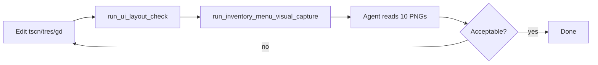

# UI Screens — Create, Edit, and Visual Review

Guide for agents and developers working on `presentation/` screens, especially the inventory menu overlay.

**Related:** [`conventions/ui-layout.md`](../conventions/ui-layout.md), [`presentation/AGENTS.md`](../../presentation/AGENTS.md), [`architecture/overlay-desktop.md`](../architecture/overlay-desktop.md).

**Cursor skills:** `/edit-ui-screens` (this workflow), `/capture-menu-screens` (capture-only).

---

## Principles

1. **Containers, not pixels** — `VBoxContainer`, `HBoxContainer`, `MarginContainer`, `GridContainer` express layout; parents own child positions.
2. **Prefabs for repetition** — slot grids, nav bars, attribute rows are baked `.tscn` prefabs, not runtime loops.
3. **Tokens, not magic numbers** — `InventoryLayout` (`inventory_layout_default.tres`) + `UiConstants` for window/combat bands.
4. **WYSIWYG in editor** — open `.tscn` and confirm structure before F5 when possible.
5. **Visual proof** — after layout edits, automated PNG capture + agent review replaces guessing from rects alone.

---

## Screen map (inventory menu)

All ten states are captured at **960×860** for review.

| State ID | What the player sees | Layout pattern |
|----------|----------------------|----------------|
| `hub_combat_bottom` | Main hub; combat band at bottom | OverlayVBox spacers |
| `hub_combat_top` | Main hub; combat band at top | OverlayVBox spacers |
| `formation_open` | Party formation overlay | Full-bleed on hub `Panel` |
| `skills_open` | Equipment skills overlay | Full-bleed on hub `Panel` |
| `attributes_open` | Stat attributes overlay | Full-bleed on hub `Panel` |
| `skill_tree_open` | Skill tree (hub hidden) | Replaces hub content |
| `warehouse_open` | Warehouse side panel | MenuArea sidecar |
| `forge_open` | Forge side panel | MenuArea sidecar |
| `worlds_open` | Portal hall (Sala de Portais) side panel | MenuArea sidecar |
| `settings_open` | Settings popup | Anchored top-right |

Hub structure:

```text
inventory_menu.tscn
└─ OverlayVBox
   ├─ TopSpacer
   ├─ MenuArea (HBox)
   │  ├─ WarehousePanel
   │  ├─ Panel → Conteudo + overlays
   │  │  └─ Conteudo (VBox)
   │  │     ├─ HubUpper (clip) → Header + hero_section
   │  │     └─ HubLower (clip, expand) → inventory_row + bottom_nav
   │  ├─ ForgePanel
   │  └─ WorldsPanel
   └─ BottomSpacer
```

`inventory_row.tscn` (lower band): **Formation** button → sort + 10×5 grid + warehouse. Heights come from `InventoryLayout.inventory_row_pixel_size()` (includes `formation_bar_height`, `hub_lower_inset_top`).

---

## Creating a new screen

### 1. Choose where it lives

| Type | Location | Example |
|------|----------|---------|
| Hub block | Prefab instanced in `inventory_menu.tscn` | `hero_section.tscn` |
| Full-bleed overlay | Child of hub `Panel` | `formation_panel.tscn` |
| Side panel | Child of `MenuArea` | `warehouse_panel.tscn` |
| Floating panel | Sibling on menu root | `SettingsPanel` |
| Non-menu HUD | `presentation/combat/` or `scenes/main.tscn` | combat HUD |

### 2. Scene checklist

1. Root `Control` or `PanelContainer`; Full Rect only on outer shell.
2. Nest containers; set `separation` on VBox/HBox.
3. `%UniqueName` on nodes referenced from scripts.
4. `tr(LocaleKeys.*)` for visible text; update `locales/*.po`.
5. `configure(menu)` pattern for panels that talk to `InventoryMenu`.
6. Signals up (`panel_open_changed`, etc.); controller in `inventory_menu.gd` wires behavior.
7. No economy/combat logic in the panel script.

### 3. Layout resource (inventory slots/toolbars)

- Edit `inventory_layout_default.tres` for shared sizes (`base_unit`, slot size, nav height).
- Apply at runtime via `_apply_panel_layout()` — do not hardcode hub width on `Panel` / `MenuArea` / `LinhaInventario` in `.tscn`.

### 4. Register visual capture (if menu-visible)

See [Adding a capture state](#adding-a-capture-state) below.

### 5. Verify

```powershell
powershell -ExecutionPolicy Bypass -File tools/run_ui_layout_check.ps1
powershell -ExecutionPolicy Bypass -File tools/run_inventory_menu_visual_capture.ps1
```

Read all PNGs in `artifacts/inventory_layout/`.

---

## Editing an existing screen

**Rule: any layout change under `presentation/inventory/` (or `inventory_layout_default.tres`) requires visual capture before the task is done.**

### Workflow



### Commands

```powershell
# Layout guardrail (headless)
powershell -ExecutionPolicy Bypass -File tools/run_ui_layout_check.ps1

# Geometry audit (headless, optional)
powershell -ExecutionPolicy Bypass -File tools/run_inventory_menu_layout_audit.ps1

# Visual capture (display required — not --headless)
powershell -ExecutionPolicy Bypass -File tools/run_inventory_menu_visual_capture.ps1

# Geometry + visual + checklist
powershell -ExecutionPolicy Bypass -File tools/run_inventory_menu_layout_review.ps1
```

Output: `artifacts/inventory_layout/<state_id>.png` + `manifest.json` (gitignored).

### What to look for in PNGs

| Issue | Often caused by |
|-------|-----------------|
| Grid crossing `inventory_bg` divider | Widget in wrong band (`HubUpper` vs `HubLower`); Formation still in `hero_section` |
| Formation on the band line | Formation not in `inventory_row`; missing `hub_lower` / layout token update |
| Grid overlapping hero | `SectionVisualOffset` or manual `position`; missing `clip_contents` on hub zones |
| Hub too narrow | `custom_minimum_size` override on `Panel`; wrong `base_unit` |
| Overlay not full-bleed | Missing Full Rect on overlay; `panel_layout.gd` not called |
| Skill tree black / settings grid bleed | `painel.visible = false` instead of `_set_inventory_visible()` |
| Side panel clipped / zero height | Missing `size_flags_vertical = EXPAND_FILL`; `_sync_side_panel_heights()` not run |
| Panel taller than combat band | Added lower-band widgets without updating `inventory_row_pixel_size()` / zone heights |
| Checkerboard in panel | Transparent window without test host bg (capture only) |

### `inventory_menu.gd` encoding

This file may revert to UTF-16 in some editors. Edit in UTF-8 when possible.

**Warning:** `tools/fix_inventory_menu_encoding.py` runs `git restore` on `inventory_menu.gd` before patching — it **discards uncommitted edits**. Use only for UTF-16 recovery on a clean file, never as a post-edit step.

---

## Adding a capture state

When a new menu-visible state must appear in screenshots:

1. **`tests/inventory_menu_layout_states.gd`**
   - Add ID to `STATE_IDS`.
   - Reset logic in `reset_menu()`.
   - Open logic in `apply_state()` (use `_show_overlay` for hub overlays; `_open_side_panel` for side panels).

2. **`tools/run_inventory_menu_visual_capture.ps1`**
   - Add ID to `$stateIds` array.

3. **`tests/inventory_menu_layout_audit.gd`**
   - Add invariants if the state has specific geometry rules.

4. **Docs / skills**
   - Update checklist in this file, [`testing.md`](testing.md), and `.cursor/skills/capture-menu-screens/SKILL.md`.

5. **Run and confirm** all PNGs generate and look correct.

---

## Allowed exceptions (absolute layout)

Documented in [`ui-layout.md`](../conventions/ui-layout.md): worlds stage map, skill tree graph, forge gem centering, `WindowManager`, `SectionVisualOffset`. Extend `ALLOWLIST` in `tools/check_ui_layout.py` for new exceptions.

---

## Module boundaries (reminder)

| Layer | May | Must not |
|-------|-----|----------|
| `presentation/` | Draw UI, emit signals, `tr()` | Mutate gold, combat rules |
| `domains/` | Business logic | Reference `Control` nodes |

---

## Manual playtest (after visual capture passes)

See [`playtest-checklist.md`](playtest-checklist.md): open/close inventory, equip, forge, warehouse, worlds, settings; no console errors on boot.
