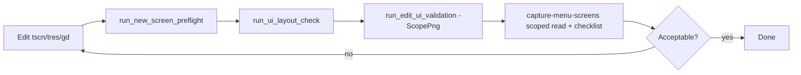

# UI Screens — Create, Edit, and Visual Review

Guide for agents and developers working on `presentation/` screens, especially the inventory menu overlay.

**Related:** [`conventions/ui-layout.md`](../conventions/ui-layout.md), [`presentation/AGENTS.md`](../../presentation/AGENTS.md), [`architecture/overlay-desktop.md`](../architecture/overlay-desktop.md).

**Cursor skills:** `/edit-ui-screens` (edit + TSCN ownership) → `/capture-menu-screens` (scoped PNG review after every edit; full mode for 12-screen audit).

**Agent index:** [`.cursor/skills/edit-ui-screens/references/project-ui-patterns.md`](../../.cursor/skills/edit-ui-screens/references/project-ui-patterns.md). **Detail:** containers, cookbook, styles, troubleshooting, editor-plugins.

---

## Principles

1. **TSCN-first design** — layout, spacing, anchors, and visual chrome (`StyleBox*`) are authored in `.tscn`. Scripts set text, visibility, and state — not structure. See [TSCN-first checklist](#tscn-first-checklist) below.
2. **Containers, not pixels** — `VBoxContainer`, `HBoxContainer`, `MarginContainer`, `GridContainer` express layout; parents own child positions.
3. **Prefabs for repetition** — slot grids, nav bars, attribute rows are baked `.tscn` prefabs, not runtime loops.
4. **Tokens, not magic numbers** — `InventoryLayout` (`inventory_layout_default.tres`) + `UiConstants` for window/combat bands.
5. **WYSIWYG in editor** — open `.tscn` and confirm structure before F5 when possible.
6. **Visual proof** — after layout edits, automated PNG capture + agent review replaces guessing from rects alone.

---

## TSCN-first checklist

Use this on **every** UI create/edit task (agents: follow before marking done):

| Step | Action |
|------|--------|
| 1 | Edit `.tscn` first — containers, `separation`, size flags, StyleBoxes |
| 2 | Grep panel `.gd` for `position`, `custom_minimum_size`, `reparent`, `StyleBoxFlat.new()` — remove layout uses |
| 3 | Popups/dropdowns: stack menu **above** button in a `VBox` (see `worlds_panel.tscn`), not `position` in script |
| 4 | Run `run_edit_ui_validation.ps1 -ScopePng <id>` (chains preflight optional, layout check, audit, capture) |
| 5 | Follow [`capture-menu-screens` scoped workflow](../../.cursor/skills/capture-menu-screens/SKILL.md#scoped-workflow-from-edit-ui-screens) — all **12** only for full review (`/capture-menu-screens`) |

**Script may:** `text`, `visible`, `disabled`, signals, `tr()`, state tints, swap **pre-baked** style references.

**Script must not:** set layout geometry or create StyleBoxes for structure at runtime.

**Reference:** `presentation/worlds/` — Portals panel rebuilt with this rule (`/edit-ui-screens` skill has full Worlds section).

---

## Screen map (inventory menu)

All **twelve** states are captured at **960×860** for review.

| State ID | What the player sees | Layout pattern |
|----------|----------------------|----------------|
| `hub_combat_bottom` | Main hub; combat band at bottom | OverlayVBox spacers |
| `hub_combat_top` | Main hub; combat band at top | OverlayVBox spacers |
| `formation_open` | Party formation overlay | Full-bleed on hub `Panel` |
| `skills_open` | Equipment skills overlay | Full-bleed on hub `Panel` |
| `attributes_open` | Stat attributes overlay | Full-bleed on hub `Panel` |
| `skill_tree_open` | Skill tree (hub hidden) | Replaces hub content |
| `warehouse_open` | Warehouse side panel | MenuArea sidecar |
| `forge_open` | Forge side panel | MenuArea sidecar |
| `worlds_open` | Portal hall (Sala de Portais) side panel | MenuArea sidecar |
| `worlds_briefing_open` | Dimension briefing before trail | MenuArea sidecar |
| `worlds_trail_open` | Trail map + header meta (20px / 8px stacks) | MenuArea sidecar |
| `settings_open` | Settings popup | Anchored top-right |

Hub structure:

```text
inventory_menu.tscn
└─ OverlayVBox
   ├─ TopSpacer
   ├─ MenuArea (HBox)
   │  ├─ WarehousePanel
   │  ├─ HubColumn
   │  │  ├─ HubChromeBar → Header (gold, quit, settings)
   │  │  └─ HubBody → HubContent + OverlayStack
   │  │     ├─ HubUpperRow → hero_equip_left + hero_character + hero_equip_right
   │  │     ├─ InventoryPanel (scroll + 5×10 grid)
   │  │     └─ BottomNav
   │  │     OverlayStack: formation, skills, attributes, skill tree, settings
   │  ├─ ForgePanel
   │  └─ WorldsPanel
   └─ BottomSpacer
```

`inventory_panel.tscn`: scroll + **5×10** grid. Sort lives in `hero_equip_right_panel.tscn`. Formation lives in `bottom_nav.tscn`. Heights come from `InventoryLayout.inventory_panel_size()`.

---

## Creating a new screen

### 0. Doc-first (agents)

1. Read [`project-ui-patterns.md`](../../.cursor/skills/edit-ui-screens/references/project-ui-patterns.md) and [`ui-layout.md`](../conventions/ui-layout.md).
2. Classify pattern; design shell + body in `.tscn` (do not clone existing panels as visual templates).
3. Bake StyleBoxes as `sub_resource` — see [`tscn-ownership.md`](../../.cursor/skills/edit-ui-screens/references/tscn-ownership.md) and [`style-recipes.md`](../../.cursor/skills/edit-ui-screens/references/style-recipes.md).
4. Optional human polish: Godot + **ui_builder** — [`editor-plugins.md`](../../.cursor/skills/edit-ui-screens/references/editor-plugins.md).

### 1. Choose where it lives

| Type | Location | Example |
|------|----------|---------|
| Hub block | Prefab instanced in `inventory_menu.tscn` | `hero_equip_left_panel.tscn`, `hero_character_panel.tscn`, etc. |
| Full-bleed overlay | Child of `%OverlayStack` under `%HubBody` | `formation_panel.tscn` |
| Side panel | Child of `MenuArea` | `warehouse_panel.tscn` |
| Settings overlay | Instance in `%OverlayStack` | `settings_panel.tscn` |
| Non-menu HUD | `presentation/combat/` or `scenes/main.tscn` | combat HUD |

### 2. Scene checklist

1. Root `Control` or `PanelContainer`; Full Rect only on outer shell.
2. Nest containers; set `separation` on VBox/HBox.
3. `%UniqueName` on nodes referenced from scripts.
4. `tr(LocaleKeys.*)` for visible text; update `locales/*.po`.
5. `configure(menu)` pattern for panels that talk to `InventoryMenu`.
6. Signals up (`panel_open_changed`, `nav_requested`, etc.); `InventoryPanelRouter` + `inventory_menu.gd` wire behavior.
7. No economy/combat logic in the panel script.

### Hub prefab edit flow

1. Open prefab in isolation (`hero_equip_left_panel.tscn`, `inventory_panel.tscn`, or `bottom_nav.tscn`).
2. Adjust containers / `%UniqueName` nodes in the 2D editor — `@tool` prefabs preview `InventoryLayout` sizes without F5.
3. Wire new UI through prefab `configure(menu)` + signals; avoid reaching into child nodes from `inventory_menu.gd`.
4. Run visual capture after hub changes (see below).

### 3. Layout resource (inventory slots/toolbars)

- Edit `inventory_layout_default.tres` for shared sizes (`base_unit`, slot size, nav height).
- Apply at runtime via `_apply_panel_layout()` — do not hardcode hub width on `HubBody` / `MenuArea` / `InventoryPanel` in `.tscn`.

### 4. Register visual capture (if menu-visible)

See [Adding a capture state](#adding-a-capture-state) below.

### 5. Verify

```powershell
powershell -ExecutionPolicy Bypass -File tools/run_edit_ui_validation.ps1 -PanelPath presentation/inventory/my_panel.gd -ScopePng warehouse_open
```

Follow [`capture-menu-screens` scoped workflow](../../.cursor/skills/capture-menu-screens/SKILL.md#scoped-workflow-from-edit-ui-screens). Use full mode for a twelve-screen review.

---

## Editing an existing screen

**Rule: any layout change under `presentation/inventory/` (or `inventory_layout_default.tres`) requires visual capture before the task is done.**

### Workflow



### Commands

```powershell
# Preflight (panel script anti-patterns + layout check)
powershell -ExecutionPolicy Bypass -File tools/run_new_screen_preflight.ps1 -PanelPath presentation/inventory/my_panel.gd

# Layout guardrail (headless)
powershell -ExecutionPolicy Bypass -File tools/run_ui_layout_check.ps1

# Geometry audit (headless, optional)
powershell -ExecutionPolicy Bypass -File tools/run_inventory_menu_layout_audit.ps1

# Full validation chain (preflight optional, layout, audit, capture)
powershell -ExecutionPolicy Bypass -File tools/run_edit_ui_validation.ps1 -ScopePng <state_id>
```

Output: `artifacts/inventory_layout/<state_id>.png` + `manifest.json` (gitignored).

### What to look for in PNGs

| Issue | Often caused by |
|-------|-----------------|
| Grid crossing `inventory_bg` divider | Widget in wrong band (`HubUpper` vs `HubLower`); Formation still in `hero_section` |
| Formation on the band line | Formation not in `inventory_row`; missing `hub_lower` / layout token update |
| Grid overlapping hero | `SectionVisualOffset` or manual `position`; missing `clip_contents` on hub zones |
| Hub too narrow | `custom_minimum_size` override on `Panel`; wrong `base_unit` |
| Overlay not full-bleed | Missing Full Rect on overlay; `panel_layout.gd` not called |
| Skill tree black / settings grid bleed | `painel.visible = false` instead of `InventoryPanelRouter.set_inventory_visible()` / `set_hub_visible()` |
| Side panel clipped / zero height | Missing `size_flags_vertical = EXPAND_FILL`; `_sync_side_panel_heights()` not run |
| Panel taller than combat band | Added lower-band widgets without updating `inventory_row_pixel_size()` / zone heights; or `base_unit` raised without `fit_panel_to_viewport()` |
| Top of `inventory_bg` clipped | Panel min height > `UiConstants.max_hub_panel_pixel_height()` — run `sync_from_base_unit()` after slot/token edits |
| Checkerboard in panel | Transparent window without test host bg (capture only) |

### `inventory_menu.gd` encoding

This file may revert to UTF-16 in some editors. Edit in UTF-8 when possible.

**Warning:** `tools/fix_inventory_menu_encoding.py` runs `git restore` on `inventory_menu.gd` before patching — it **discards uncommitted edits**. Use only for UTF-16 recovery on a clean file, never as a post-edit step.

---

## Adding a capture state

When a new menu-visible state must appear in screenshots:

1. **`tests/inventory_menu_layout_states.gd`**
   - Add ID to `STATE_IDS`.
   - Reset logic in `reset_menu()`.
   - Open logic in `apply_state()` (use `_show_overlay` for hub overlays; `_open_side_panel` for side panels).

2. **`tools/run_inventory_menu_visual_capture.ps1`**
   - Add ID to `$stateIds` array.

3. **`tests/inventory_menu_layout_audit.gd`**
   - Add invariants if the state has specific geometry rules.

4. **Docs / skills**
   - Update checklist in this file, [`testing.md`](testing.md), and `.cursor/skills/capture-menu-screens/SKILL.md`.

5. **Run and confirm** all PNGs generate and look correct.

---

## Allowed exceptions (absolute layout)

Documented in [`ui-layout.md`](../conventions/ui-layout.md): trail map **UV anchors baked in `trail_map_view.tscn`** (not set in script), skill tree graph, forge gem centering, `WindowManager`, `SectionVisualOffset`. Extend `ALLOWLIST` in `tools/check_ui_layout.py` for new exceptions.

**Not an exception:** positioning widgets, menus, or banners in `.gd` — move to `.tscn` instead.

---

## Module boundaries (reminder)

| Layer | May | Must not |
|-------|-----|----------|
| `presentation/` | Draw UI, emit signals, `tr()` | Mutate gold, combat rules |
| `domains/` | Business logic | Reference `Control` nodes |

---

## Manual playtest (after visual capture passes)

See [`playtest-checklist.md`](playtest-checklist.md): open/close inventory, equip, forge, warehouse, worlds, settings; no console errors on boot.
